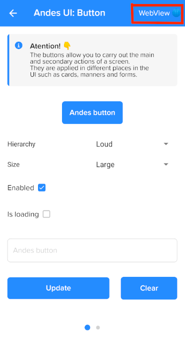
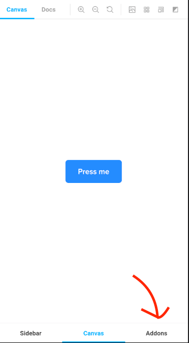
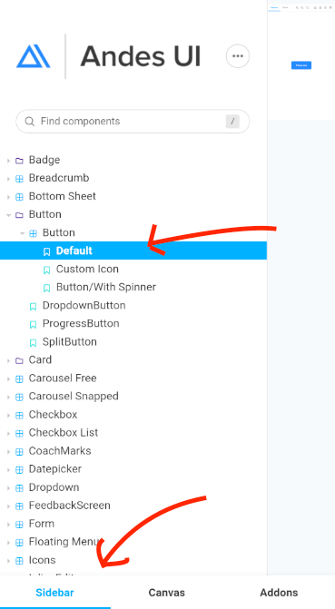

# Andes UI

Andes UI is a library which contains all the UI components defined with its functionality and tries to generate a unified design language along Mercado Libre.

From IT (native + web) in conjunction with UX, we are looking forward to creating conventions to refer to each component so everybody could understand and talks about the same.


* Android Usage & API Docs ==> You're here!
* [Design guidelines](https://company-161429.frontify.com/d/kxHCRixezmfK/n-a) (Frontify)

Are you lost? Try these...
* [iOS version](https://github.com/mercadolibre/fury_andesui-ios)
* [React version](https://github.com/mercadolibre/frontend-andes_ui)

### Live examples
Install our Showcase App via Meli Store and enjoy it!


### New! WebView live examples
#### Access to the live example of the WebView version for each component.
Navigate to the desired component screen, and click in the "WebView" button, in the action bar.



Inside the web storybook you can access to the Addons section, where you can modify the different properties the component allows (change the text value, test the available colors, and more)



You can also navigate to the sidebar, where you can find the different variants for the component. For example, in the button, you can choose between the Default implementation, the Icon implementation, the Progress implementation, and more.



#### Open any storybook web component in a WebView
Navigate to any component present in any version of the storybook, including forked versions!

You only need to launch a deeplink with this structure:

"meli://andes/storybook?url=[https://www.your-link-to-the-storybook.com]()"

Example: install the demoapp, run it through the Android Studio Emulator and launch the following deeplink from the command line:

```console
adb shell am start -a android.intent.action.VIEW -d "meli://andes/storybook?url=https://tnovas.github.io/fury_frontend-andes-ui/?path=/docs/documentation-button--default-story"
```

## Definitions

* Monomodule
* Each class has the prefix "Andes" or "andes" depending on the use case.
* Well-defined and intuitive architecture.
* Has custom attributes that allows the devs specify the component they would like to use.
* Components can be used by XML or programmatically.
* Compatible with Jetpack Compose.

## Contributing
See the [CONTRIBUTING](https://github.com/mercadolibre/fury_andesui-android/blob/master/CONTRIBUTING.md)

## Accessibility Playground
* [A11y Playground](a11y-playground/A11yPlayground.md)

## Setup
See the [Setup page](Setup.md) to apply production styles in Mercado Libre & Mercado Pago modules. In case your module belongs to other app check how is configured in the main proyect. To setup your app module manually read Fonts & Colors section.

## Fonts & Colors
See the [Fonts & Colors page](Fonts&Colors.md) to be aware of how to use the proper Colors and Fonts with AndesUI.

## Iconography
Check the [Iconography page](Iconography.md) to read about where to find our icons and how to add a new one.

## Components
| Component | Deeplink |
| -------- | -------- |
| [AndesAutosuggest](autosuggest/AndesAutosuggest.md) | andes://textfield |
| [AndesBadge](badge/AndesBadge.md) | meli://andes/badge |
| [AndesBadgeIconPill](badge/AndesBadgeIconPill.md) | andes://badge |
| [AndesBadgePill](badge/AndesBadgePill.md) | andes://badge |
| [AndesButton](button/AndesButton.md) | andes://button |
| [AndesCarousel](carousel/AndesCarousel.md) | andes://carousel |
| [AndesCheckbox](checkbox/AndesCheckbox.md) | andes://checkbox |
| [AndesCoachMark](coachmark/AndesCoachMark.md) | andes://coachmark |
| [AndesDatePicker](datepicker/AndesDatePicker.md) | andes://datepicker |
| [AndesDropdown](dropdown/AndesDropdown.md) | andes://dropdown |
| [AndesFeedbackScreen](feedbackscreen/AndesFeedbackScreen.md) | andes://feedbackscreen |
| [AndesFloatingMenu](floatingmenu/AndesFloatingMenu.md) | andes://floatingmenu |
| [AndesList](list/AndesList.md) | andes://list |
| [AndesMessage](message/AndesMessage.md) | andes://message |
| [AndesModal](modal/AndesModal.md) |  |
| [AndesMoneyAmount](moneyamount/AndesMoneyAmount.md) | andes://moneyamount |
| [AndesMoneyAmountCombo](moneyamount/AndesMoneyAmountCombo.md) | andes://moneyamount |
| [AndesMoneyAmountDiscount](moneyamount/AndesMoneyAmountDiscount.md) | andes://moneyamount |
| [AndesSnackbar](slider/AndesSlider.md) | andes://slider |
| [AndesSnackbar](snackbar/AndesSnackbar.md) | andes://snackbar |
| [AndesSwitch](switch/AndesSwitch.md) | andes://switch |
| [AndesTabs](tabs/AndesTabs.md) | andes://tabs |
| [AndesTag](tag/AndesTag.md) | andes://tag |
| [AndesTextfield](textfield/AndesTextfield.md) | andes://textfield |
| [AndesTextView](textview/AndesTextView.md) | andes://typography |
| [AndesThumbnail](thumbnail/AndesThumbnail.md) | andes://thumbnail |
| [AndesThumbnailBadge](thumbnail/AndesThumbnailBadge.md) | andes://thumbnail |
| [AndesTimePicker](timepicker/AndesTimePicker.md) | andes://timepicker |
| [AndesTooltip](tooltip/AndesTooltip.md) | andes://tooltip |
| [AndesButtonGroup](buttongroup/AndesButtonGroup.md) | andes://buttongroup |

### Open any component deeplink in Andes Showcase App
First you need to install [Andes Showcase App](#live-examples). Then run the following `adb` command in your terminal.
```console
adb shell am start -a android.intent.action.VIEW -d "andes://{component}"
```
If you don't use Android Studio install any app to test deeplinks, for example: "Deep Link Tester". Then enter any component deeplink in your app: `andes://{component}`.
