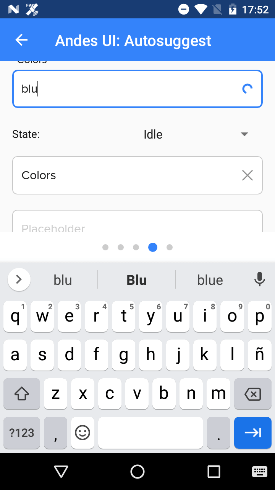
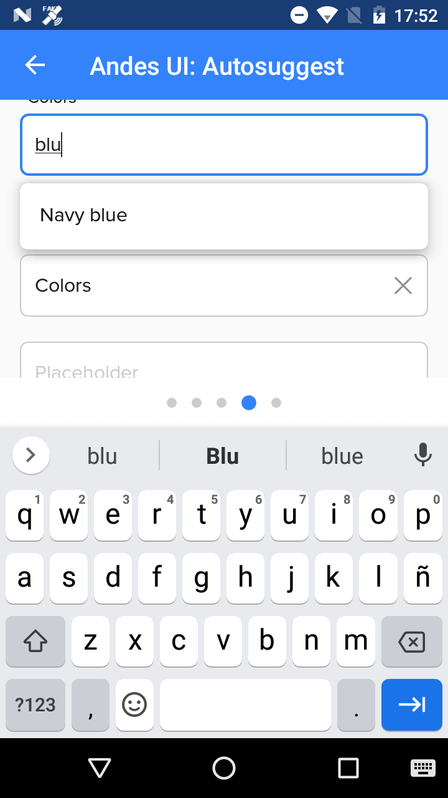

# AndesAutosuggest

AndesAutosuggest is a textfield that has the ability to show a floating menu with suggestions. 
[See Andes UI component in frontify](https://company-161429.frontify.com/d/kxHCRixezmfK/n-a#/components/textfield)

```kotlin
class AndesAutosuggest : ConstraintLayout, AndesListDelegate
```

Basic Sample Programatically

```kotlin
AndesAutosuggest(context)
```

<br/>

## Constructors
| Summary |
| --- |
| [AndesAutosuggest](#andesautosuggestcontext-context-label-string-helper-string-placeholder-string-state-andestextfieldstate)(context: Context, label: String?, helper: String?, placeholder: String?, state: AndesTextfieldState) |

<br/>

##### AndesAutosuggest(context: Context, label: String?, helper: String?, placeholder: String?, state: AndesTextfieldState)
| Parameter | Description |
| -------- | ------- |
| context | **Context**|
| label | **String**: text to be shown above the textfield. |
| helper | **String**: text to be shown below the textfield. |
| placeholder | **String**: text to be shown inside the textfield when it's empty. |
| state | **AndesTextfieldState**: the state of the textfield that will give it a specific style. |

<br/>

## Properties
| Property | Summary |
| -------- | ------- |
| text | **get():** retrieves the current value of the textfield. <br/> **set(value: String?):** updates textfield value. |
| label | **get():** retrieves the label of the textfield. <br/> **set(value: String?):** updates textfield label. |
| helper | **get():** retrieves the helper of the textfield. <br/> **set(value: String?):** updates textfield helper. |
| placeholder | **get():** retrieves the placeholder of the textfield. <br/> **set(value: String?):** updates textfield placeholder. |
| state | **get():** retrieves the state of the textfield. <br/> **set(value: AndesTextfieldState):** updates textfield state. |
| textFilter | **get():** retrieves the current text filter of the textfield. <br/> **set(value: InputFilter?):** applies the given filter to the textfield. |
| inputType | **get():** retrieves the current input type of the textfield. <br/> **set(value: Int):** applies the given type for the content of the to the textfield. |
| rightContent | **get():** retrieves the current right content of the textfield. <br/> **set(value: AndesTextfieldRightContent?):** updates the content at the right of the textfield. |
| textWatcher | **get():** retrieves the current text watcher of the textfield. <br/> **set(value: TextWatcher?):** attach a text watcher to the textfield to be aware about the changes on it. |
| onTouch | **get():** retrieves the current on touch action of the textfield. <br/> **set(value: ((MotionEvent) -> Unit)?):** register a callback to be invoked when a touch event is sent to the textfield. |
| suggestionsDelegate | **get():** retrieves the current andes list delegate. <br/> **set(value: AndesListDelegate):** updates the delegate responsible for giving the information to display on the floating menu. |

<br/>

#### Functions
| Return type | Method |
| -------- | ------- |
| Unit | **showSuggestions()**<br/> Shows the floating menu with the suggestions indicated by the suggestions delegate. If the floating menu is already being showed it will update its size and position. |
| Unit | **hideSuggestions()**<br/> Hides the floating menu with the suggestions. If the floating menu is not being showed it will do nothing. |
| Unit | **setSelection(position: Int)**<br/> Moves the cursor to the given position. |
| Unit | **setRightIcon(iconPath: String, listener: OnClickListener?, colorIcon: Int?, hideWhenType: Boolean)**<br/> Set the right content to icon and provides an interface to give the icon path.<br/>**iconPath**: the name of the icon to be shown.<br/>**listener**: a callback to be invoked when the icon is clicked.<br/>**colorIcon**: a color to tint the icon.<br/>**hideWhenType**: hides the icon when writing more than 4 characters. |
| Unit | **setOnShowListener(listener: OnShowListener?)**<br/> Sets OnShowListener to notify when the suggestions are shown. |
| Unit | **setOnDismissListener(listener: OnDismissListener?)**<br/> Sets OnDismissListener to notify when suggestions are

<br/>

## Screenshots

