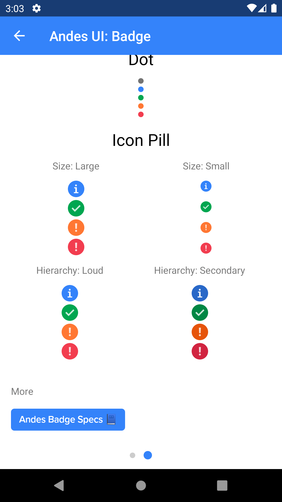

# AndesBadgeIconPill

AndesBadgeIconPill is a small unit of information that allow you to indicate the status of an item or differentiate several similar items from each other.  
[See Andes UI component in frontify](https://company-161429.frontify.com/d/kxHCRixezmfK/n-a#/components/badge/pill)

```kotlin
class AndesBadgeIconPill : ConstraintLayout
```

Basic Sample Programatically

```kotlin
AndesBadgeIconPill(context)
```
Basic Sample XML

```xml
<com.mercadolibre.android.andesui.badge.AndesBadgeIconPill
    android:layout_width="wrap_content"
    android:layout_height="wrap_content"
    app:andesBadgeIconPillSize="large"
    app:andesBadgeIconPillType="highlight" />
```
<br/>

## XML Attributes
| Property | Summary |
| -------- | ------- |
| app:andesBadgeIconPillType | Set a color palette for the badge: **highlight**, **success**, **warning**, **error** |
| app:andesBadgeIconPillSize | Badge display size: **large**, **small** |

<br/>

## Constructors
| Summary |
| --- |
| AndesBadgeIconPill(context: Context, attrs: AttributeSet?) |
| AndesBadgeIconPill(context: Context, type: [AndesBadgeIconType](#andesbadgeicontype), size: [AndesBadgePillSize](#andesbadgepillsize))|

<br/>

##### AndesBadgeIconPill(context: Context, type: AndesBadgeIconType, size: AndesBadgePillSize)
| Parameter | Description |
| -------- | ------- |
| context | **Context**|
| type | **[AndesBadgeIconType](#andesbadgeicontype)**: badge color palette. Default type is **HIGHLIGHT** |
| size | **[AndesBadgePillSize](#andesbadgepillsize)**: badge display size. Default size is **SMALL** |

<br/>

## Properties
| Property | Summary |
| -------- | ------- |
| type: [AndesBadgeIconType](#andesbadgeicontype) | **get():** retrieves badge color palette <br/> **set(value: [AndesBadgeIconType](#andesbadgeicontype)):** updates badge color palette |
| size: [AndesBadgePillSize](#andesbadgepillsize) | **get():** retrieves badge displayed size <br/> **set(value: [AndesBadgePillSize](#andesbadgepillsize)):** updates badge display size |

<br/>

## Related Classes

### AndesBadgeIconType
Defines the possible styles [AndesBadgeIconPill](#andesbadgeiconpill) can take.
```kotlin
enum class AndesBadgeIconType
```
| Enum Values | Description |
| --------- | ------------- |
| HIGHLIGHT | Gives a blue color style to the component<br/> |
| SUCCESS | Gives a green color style to the component<br/> |
| WARNING | Gives an orange color style to the component<br/> |
| ERROR | Gives a red color style to the component<br/> |

<br/>

#### Functions
| Return type | Method |
| -------- | ------- |
| AndesBadgeIconType | **fromString(value: String)**<br/> Retrieves an AndesBadgeIconType that matches the string value |

<br/>

### AndesBadgePillSize
Defines the possible sizes [AndesBadgeIconPill](#andesbadgeiconpill) can take.
```kotlin
enum class AndesBadgePillSize
```
| Enum Values | Description |
| ----------- | ----------- |
| SMALL | Small badge size<br/> |
| LARGE | Large badge size<br/> |

<br/>

#### Functions
| Return type | Method |
| -------- | ------- |
| AndesBadgePillSize | **fromString(value: String)**<br/> Retrieves an AndesBadgePillSize that matches the string value |

<br/>

## Screenshots
