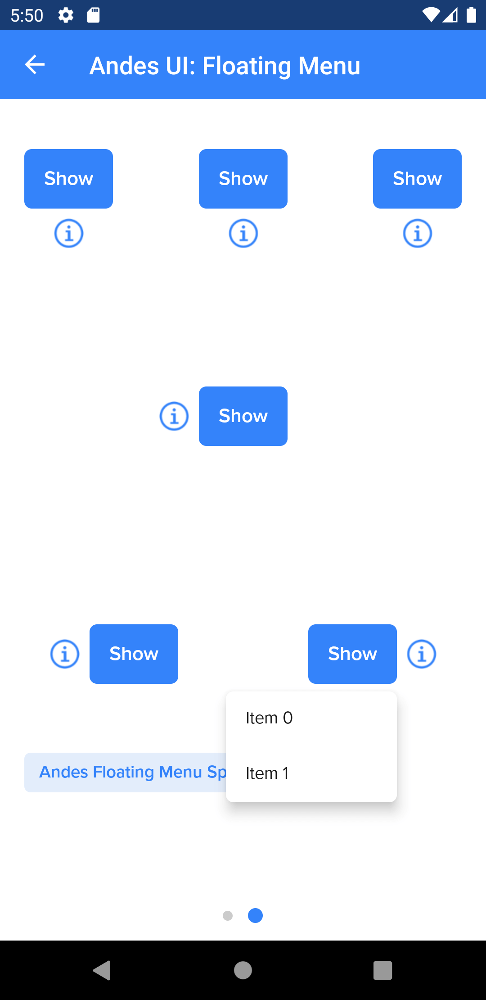

# AndesFloatingMenu

AndesFloatingMenu is a card over the rest of the content that shows lists with actionable or selectable rows. 
[See Andes UI component in frontify](https://company-161429.frontify.com/d/kxHCRixezmfK/n-a#/components/floating-menu)

```kotlin
class AndesFloatingMenu
```

Basic Sample Programatically

```kotlin
AndesFloatingMenu(context, andesList)
```

<br/>

## Constructors
| Summary |
| --- |
| [AndesFloatingMenu](#andesfloatingmenucontext-context-andeslist-andeslist-width-andesfloatingmenuwidth-rows-andesfloatingmenurows-orientation-andesfloatingmenuorientation)(context: Context, andesList: AndesList, width: [AndesFloatingMenuWidth](#andesfloatingmenuwidth), rows: [AndesFloatingMenuRows](#andesfloatingmenurows), orientation: [AndesFloatingMenuOrientation](#andesfloatingmenuorientation)) |

<br/>

##### AndesFloatingMenu(context: Context, andesList: AndesList, width: AndesFloatingMenuWidth, rows: AndesFloatingMenuRows, orientation: AndesFloatingMenuOrientation)
| Parameter | Description |
| -------- | ------- |
| context | **Context**|
| andesList | **AndesList**: list of actionable rows. |
| width | **[AndesFloatingMenuWidth](#andesfloatingmenuwidth)**: floating menu width type. |
| rows | **[AndesFloatingMenuRows](#andesfloatingmenurows)**: floating menu max rows showed without scrolling. |
| orientation | **[AndesFloatingMenuOrientation](#andesfloatingmenuorientation)**: floating menu horizontal required orientation. |

<br/>

## Properties
| Property | Summary |
| -------- | ------- |
| width: [AndesFloatingMenuWidth](#andesfloatingmenuwidth) | **get():** retrieves floating menu width type. <br/> **set(value: [AndesFloatingMenuWidth](#andesfloatingmenuwidth)):** updates floating menu width type. |
| rows: [AndesFloatingMenuRows](#andesfloatingmenurows) | **get():** retrieves floating menu max rows showed. <br/> **set(value: [AndesFloatingMenuRows](#andesfloatingmenurows)):** updates floating menu max rows showed. |
| orientation: [AndesFloatingMenuOrientation](#andesfloatingmenuorientation) | **get():** retrieves floating menu horizontal required orientation. <br/> **set(value: [AndesFloatingMenuOrientation](#andesfloatingmenuorientation)):** updates floating menu horizontal required orientation. |

<br/>

#### Functions
| Return type | Method |
| -------- | ------- |
| Unit | **show(parentView: View)**<br/> Shows floating menu content on screen. If the FloatingMenu is already being showed it will do nothing.<br/>**parentView**: view that will trigger floating menu. |
| Unit | **dismiss()**<br/> Stops showing floating menu on screen. If it is not being showed it will do nothing. |
| Unit | **setOnShowListener(listener: OnShowListener?)**<br/> Sets OnShowListener to notify when floating menu is shown. |
| Unit | **setOnDismissListener(listener: OnDismissListener?)**<br/> Sets OnDismissListener to notify when floating menu is dismissed. |

<br/>

## Related Classes

### AndesFloatingMenuWidth
Defines the possible widths [AndesFloatingMenu](#andesfloatingmenu) can take.
```kotlin
sealed class AndesFloatingMenuWidth
```
| Values | Description |
| --------- | ------------- |
| Fixed | Gives parent view width to the floating menu.<br/>|
| Custom | **Custom(val width: Int)**: Gives a custom width size in pixels to the floating menu.<br/>|

<br/>

### AndesFloatingMenuRows
Defines the possible rows [AndesFloatingMenu](#andesfloatingmenu) can take.
```kotlin
sealed class AndesFloatingMenuRows
```
| Values | Description |
| --------- | ------------- |
| Small | Gives a height of 3.5 rows to the floating menu.<br/> |
| Medium | Gives a height of 5.5 rows to the floating menu.<br/> |
| Max | Gives max possible height to the floating menu.<br/> |

<br/>

#### Functions
| Return type | Method |
| -------- | ------- |
| AndesFloatingMenuRows | **fromString(value: String)**<br/> Retrieves an AndesFloatingMenuRows that matches the string value |

<br/>

### AndesFloatingMenuOrientation
Defines the required horizontal orientations [AndesFloatingMenu](#andesfloatingmenu) can take. In case the required orientation can not satisfy the size of the content it will be changed. The priority is always to show the content.
```kotlin
sealed class AndesFloatingMenuOrientation
```
| Values | Description |
| --------- | ------------- |
| Left | Floating menu will be showed from the end of the trigger to the left if possible. If not it will be showed with Right configuration.<br/> |
| Right | Floating menu will be showed from the start of the trigger to the right if possible. If not it will be showed with Left configuration.<br/> |

<br/>

#### Functions
| Return type | Method |
| -------- | ------- |
| AndesFloatingMenuOrientation | **fromString(value: String)**<br/> Retrieves an AndesFloatingMenuOrientation that matches the string value |

<br/>

### OnShowListener
Interface used to allow the creator of [AndesFloatingMenu](#andesfloatingmenu) to run some code when the dialog is shown.
```kotlin
interface OnShowListener
```
#### Functions
| Return type | Method |
| -------- | ------- |
| Unit | **onShow()**<br/> Method invoked when floating menu is shown. |

<br/>

### OnShowListener
Interface used to allow the creator of [AndesFloatingMenu](#andesfloatingmenu) to run some code when the dialog is dismissed.
```kotlin
interface OnDismissListener
```
#### Functions
| Return type | Method |
| -------- | ------- |
| Unit | **onDismiss()**<br/> Method invoked when floating menu is dismissed. |

<br/>

## Screenshots


