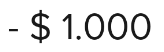

# AndesMoneyAmount

AndesMoneyAmount is used to refer to the value of an item or to a specific amount of money.
[See Andes UI component in frontify](https://company-161429.frontify.com/d/kxHCRixezmfK/n-a#/components/money-amount)

```kotlin
class AndesMoneyAmount : androidx.appcompat.widget.AppCompatTextView
```

Basic Sample Programatically

```kotlin
AndesMoneyAmount(
    context = this,
    amount = 100.0,
    currency = AndesMoneyAmountCurrency.ARS
)
```

Basic Sample XML

```xml
 <com.mercadolibre.android.andesui.moneyamount.AndesMoneyAmount
        android:layout_width="wrap_content"
        android:layout_height="wrap_content"
        app:andesMoneyAmount="1234.56"
        app:andesMoneyAmountCurrency="EUR"
        app:andesMoneyAmountSize="size_20"
        app:andesMoneyAmountStyle="normal"
        app:andesMoneyAmountType="negative"
        app:andesShowZerosDecimal="true" />

```

<br/>

## XML Attributes
| Property | Summary |
| -------- | ------- |
| app:andesMoneyAmountSize | Text size: **size_12**, **size_14**, **size_16**, **size_18**, **size_20**, **size_24**, **size_28**, **size_32**, **size_36**, **size_40**, **size_44**, **size_48**, **size_52**, **size_56**, **size_60** |
| app:andesMoneyAmountType | Represents text sign style: **positive**, **negative**, **previous** |
| app:andesMoneyAmountStyle | Decimal part style of amount : **none**, **normal**, **superscript** |
| app:andesMoneyAmountCurrency | Represents the currency of the amount that will be shown: **BRL**, **UYU**, **CLP**, **CLF**, **MXN**, **DOP**, **PAB**, **COP**, **VEF**, **EUR**, **PEN**, **CRC**, **ARS**, **USD**, **BOB**, **GTQ**, **PYG**, **HNL**, **NIO**, **CUC**, **VES** |
| app:andesMoneyAmountCountry | Represents the country decimal and thousand separator style: **AR**, **BR**, **CL**, **CO**, **MX**, **CR**, **PE**, **EC**, **PA**, **DO**, **UY**, **VE**, **BO**, **PY**, **GT**, **HN**, **NI**, **SV**, **PR**, **CU** |
| app:andesMoneyAmount | Amount number to be shown (float) |
| app:andesShowZerosDecimal | Show decimal part when it is exactly 0: **true**, **false** |

<br/>

## Constructors
| Summary |
| --- |
| AndesMoneyAmount(context: Context, attrs: AttributeSet?)  |
| AndesMoneyAmount(context: Context, amount: Double, currency: AndesMoneyAmountCurrency, showZerosDecimal: Boolean, size: AndesMoneyAmountSize, type: AndesMoneyAmountType, style: AndesMoneyAmountDecimalsStyle, country: AndesCountry) |

<br/>

##### AndesMoneyAmount(context: Context, amount: Double, currency: AndesMoneyAmountCurrency, showZerosDecimal: Boolean, size: AndesMoneyAmountSize, type: AndesMoneyAmountType, style: AndesMoneyAmountDecimalsStyle, country: AndesCountry)
| Parameter | Description |
| -------- | ------- |
| context | **Context** |
| amount | **Double**: amount number to be shown. |
| currency | **[AndesMoneyAmountCurrency](#andesmoneyamountcurrency)**: represents the currency of the amount that will be shown. |
| showZerosDecimal | **Boolean**: show or hide decimal part of the amount when it is exactly 0. |
| size | **[AndesMoneyAmountSize](#andesmoneyamountsize)**: text size. |
| type | **[AndesMoneyAmountType](#andesmoneyamounttype)**: represents text sign style. |
| style | **[AndesMoneyAmountDecimalsStyle](#andesmoneyamountdecimalsstyle)**: Decimal part style. |
| country | **[AndesCountry](#andescountry)**: represents the country decimal and thousand separator style. |

<br/>

## Properties
| Property | Summary |
| -------- | ------- |
| amount: Double | **get():** retrieves number shown. <br/> **set(value: Double):** updates amount to be shown. |
| type: [AndesMoneyAmountType](#andesmoneyamounttype) | **get():** retrieves text sign style. <br/> **set(value: AndesMoneyAmountType):** updates text sign style. |
| size: [AndesMoneyAmountSize](#andesmoneyamountsize) | **get():** retrieves text size. <br/> **set(value: AndesMoneyAmountSize):** updates text size. |
| currency: [AndesMoneyAmountCurrency](#andesmoneyamountcurrency) | **get():** retrieves the currency of the amount that will be shown. <br/> **set(value: AndesMoneyAmountCurrency):** updates the currency of the amount that will be shown. |
| country: [AndesCountry](#andescountry) | **get():** retrieves the country decimal and thousand separator style. <br/> **set(value: AndesCountry):** updates country to change decimal and thousand separator style. |
| decimalsStyle: [AndesMoneyAmountDecimalsStyle](#andesmoneyamountdecimalsstyle) | **get():** retrieves the style of the decimal part.  <br/> **set(value: AndesMoneyAmountDecimalsStyle):** updates the style of the decimal part. |
| showZerosDecimal: Boolean | **get():** retrieves if the decimal part is displayed or not. <br/> **set(value: Boolean):** updates visibility of amount decimal part. |

<br/>

## Related Classes

### AndesMoneyAmountType
Defines the possible types an [AndesMoneyAmount](#andesmoneyamount) can take. This will change de display style.
```kotlin
enum class AndesMoneyAmountType
```
| Values | Description |
| ----------- | ----------- |
| POSITIVE | Default type to display a positive amount.<br/> |
| NEGATIVE | Type used to display a negative amount. It will add a minus prefix.<br/> |
| PREVIOUS | Type used to display a previous amount. It will set a strike out the displayed text. <br/> |

<br/>

#### Functions
| Return type | Method |
| -------- | ------- |
| AndesMoneyAmountType | **fromString(value: String)**<br/> Retrieves an AndesMoneyAmountType that matches the string value |


### AndesMoneyAmountCurrency
Defines the possible currencies an [AndesMoneyAmount](#andesmoneyamount) can take. It will define text a11y description, decimal places and symbol.
```kotlin
enum class AndesMoneyAmountCurrency
```
| Values | Description |
| ----------- | ----------- |
| BRL | Brazilean currency |
| UYU | Uruguayan currency |
| CLP | Chilean currency |
| MXN | Mexican currency |
| DOP | Dominican currency |
| PAB | Panamanian currency |
| COP | Colombian currency |
| VES | Venezuelan currency (bolivar) |
| VEF | Venezuelan currency (bolivar fuerte) |
| PEN | Peruvian currency |
| CRC | Costa Rican currency |
| ARS | Argentinian currency |
| CLF | Chilean currency (unidad de fomento) |
| USD | American currency |
| BOB | Bolivian currency |
| PYG | Paraguayan currency |
| GTQ | Guatemalan currency |
| HNL | Honduran currency |
| NIO | Nicaraguan currency |
| EUR | European currency |
| CUC | Cuban currency |

<br/>


### AndesMoneyAmountSize
Defines the text sizes [AndesMoneyAmount](#andesmoneyamount) can take.
```kotlin
enum class AndesMoneyAmountSize
```
| Enum Values | Description |
| ----------- | ----------- |
| SIZE_12 | 12sp component size |
| SIZE_14 | 14sp component size |
| SIZE_16 | 16sp component size |
| SIZE_18 | 18sp component size |
| SIZE_20 | 20sp component size |
| SIZE_24 | 24sp component size |
| SIZE_28 | 28sp component size |
| SIZE_32 | 32sp component size |
| SIZE_36 | 36sp component size |
| SIZE_40 | 40sp component size |
| SIZE_44 | 44sp component size |
| SIZE_48 | 48sp component size |
| SIZE_52 | 52sp component size |
| SIZE_56 | 56sp component size |
| SIZE_60 | 60sp component size |

<br/>

#### Functions
| Return type | Method |
| -------- | ------- |
| AndesMoneyAmountSize | **fromString(value: String)**<br/> Retrieves an AndesMoneyAmountSize that matches the string value |

<br/>

### AndesMoneyAmountDecimalsStyle
Defines the possible styles [AndesMoneyAmount](#andesmoneyamount) decimal part can take.
```kotlin
enum class AndesMoneyAmountDecimalsStyle
```
| Enum Values | Description |
| ----------- | ----------- |
| NONE | It will remove decimal part from the amount rounding to an Integer amount.<br/> |
| NORMAL | It will show decimal part with [AndesCountry](#andescountry) decimal separator.<br/>  |
| SUPERSCRIPT | It will show decimal part as a superscript (this style does not work for SIZE_12 and SIZE_14).<br/>  |

<br/>

#### Functions
| Return type | Method |
| -------- | ------- |
| AndesMoneyAmountDecimalsStyle | **fromString(value: String)**<br/> Retrieves an AndesMoneyAmountDecimalsStyle that matches the string value |

<br/>

### AndesCountry
Defines the possible countries that can be used in AndesUI library.
```kotlin
enum class AndesCountry
```
| Enum Values | Description |
| ----------- | ----------- |
| AR | Argentina |
| BR | Brazil |
| CL | Chile |
| CO | Colombia |
| MX | Mexico |
| CR | Costa Rica |
| PE | Perú |
| EC | Ecuador |
| PA | Panamá |
| DO | Domincan Republic |
| UY | Uruguay |
| BO | Bolivia |
| PY | Paraguay |
| GT | Guatemala |
| HN | Honduras |
| NI | Nicaragua |
| SV | El Salvador |
| PR | Puerto Rico |
| CU | Cuba |

<br/>

#### Functions
| Return type | Method |
| -------- | ------- |
| AndesCountry | **fromString(value: String)**<br/> Retrieves an AndesCountry that matches the string value |

<br/>

## Screenshots
