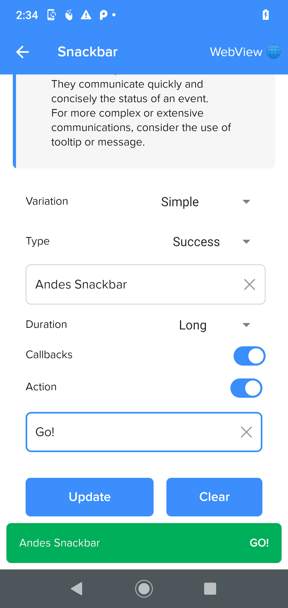

# AndesSnackbar

AndesSnackbar communicate the status of an event quickly and concisely.
[See Andes UI component in frontify](https://company-161429.frontify.com/d/kxHCRixezmfK/n-a#/components/snackbar)

```kotlin
class AndesSnackbar : CardView
```

Basic Sample Programatically

```kotlin
AndesSnackbar(context, container, AndesSnackbarType.NEUTRAL, "Snackbar!", AndesSnackbarDuration.DEFAULT)
```
This component can't be created via XML.
<br/>

## Constructors
| Summary |
| --- |
| [AndesSnackbar](#andessnackbarcontext-context-view-view-type-andessnackbartype-text-string-duration-andessnackbarduration)(context: Context, view: View, type: [AndesSnackbarType](#andessnackbartype), text: String, duration: [AndesSnackbarDuration](#andessnackbarduration)) |
| [AndesSnackbar](#andessnackbarcontext-context-view-view-type-andessnackbartype-text-string-duration-andessnackbarduration-action-andessnackbaraction)(context: Context, view: View, type: [AndesSnackbarType](#andessnackbartype), text: String, duration: [AndesSnackbarDuration](#andessnackbarduration), action: [AndesSnackbarAction](#andessnackbaraction)) |
| [AndesSnackbar](#andessnackbarcontext-context-view-view-errorCode-string-text-string-duration-andessnackbarduration)(context: Context, view: View, errorCode: String, text: String, duration: [AndesSnackbarDuration](#andessnackbarduration), action: [AndesSnackbarAction?](#andessnackbaraction)) |

<br/>

##### AndesSnackbar(context: Context, view: View, type: AndesSnackbarType, text: String, duration: AndesSnackbarDuration)
| Parameter | Description |
| -------- | ------- |
| context | **Context**|
| view | **View**: container view where snackbar will be attached. |
| type | **[AndesSnackbarType](#andessnackbartype)**: snackbar color palette style. |
| text | **String**: snackbar text to display. |
| duration | **[AndesSnackbarDuration](#andessnackbarduration)**: how long to display the message. |

##### AndesSnackbar(context: Context, view: View, type: AndesSnackbarType, text: String, duration: AndesSnackbarDuration, action: AndesSnackbarAction)
| Parameter | Description |
| -------- | ------- |
| context | **Context**|
| view | **View**: container view where snackbar will be attached. |
| type | **[AndesSnackbarType](#andessnackbartype)**: snackbar color palette style. |
| text | **String**: snackbar text to display. |
| duration | **[AndesSnackbarDuration](#andessnackbarduration)**: how long to display the message. |
| action | **[AndesSnackbarAction](#andessnackbaraction)**: set snackbar button text and callback |


##### AndesSnackbar(context: Context, view: View, errorCode: String, text: String, duration: AndesSnackbarDuration, action: AndesSnackbarAction?)
| Parameter | Description |
| -------- | ------- |
| context | **Context**|
| view | **View**: container view where snackbar will be attached. |
| errorCode | **String**: snackbar error code to display, setting this attribute make the snackbar color turn red |
| text | **String**: snackbar text to display. |
| duration | **[AndesSnackbarDuration](#andessnackbarduration)**: how long to display the message. |
| action | **[AndesSnackbarAction](#andessnackbaraction)**: set snackbar button text and callback |


<br/>

## Properties
| Property | Summary |
| -------- | ------- |
| type: [AndesSnackbarType](#andessnackbartype) | **get():** retrieves snackbar color palette style. <br/> **set(value: AndesSnackbarType):** updates snackbar color palette style. |
| text: String? | **get():** retrieves snackbar text displayed. <br/> **set(value: String?):** updates snackbar text displayed. |
| duration: [AndesSnackbarDuration](#andessnackbarduration) | **get():** retrieves how long to display the message. <br/> **set(value: AndesSnackbarDuration):** updates how long to display the message. |
| action: [AndesSnackbarAction?](#andessnackbaraction) | **get():** retrieves snackbar button text and callback. <br/> **set(value: AndesSnackbarAction?):** updates snackbar button text and callback. |
| errorCode: String? | **get():** retrieves snackbar errorCode displayed. <br/> **set(value: String?):** updates snackbar errorCode displayed. Setting this attribute make the snackbar color turn red |

<br/>

## Functions
| Return type | Method |
| ----------- | ------ |
| Unit | **show()** <br/> Shows the snackbar for [AndesSnackbarDuration](#andessnackbarduration) time. |
| Unit | **dismiss()** <br/> Dismisses snackbar in case it is being displayed. |
| Boolean | **isShown()** <br/> Retrives if the snackbar is being displayed or not. |
| Unit | **addCallback(callback: AndesSnackbarCallback)** <br/> Add a new callback to the snackbar. |
| Unit | **removeCallback(callback: AndesSnackbarCallback)** <br/> remove an added callback. |

<br/>

## Related Classes

### AndesSnackbarType
Defines the possible color palettes that snackbar can take.
```kotlin
enum class AndesSnackbarType
```
| Enum Values | Description |
| ----------- | ----------- |
| NEUTRAL | Gives a gray color style to the component<br/> |
| ERROR | Gives a red color red to the component<br/> |
| SUCCESS | Gives a green color style to the component<br/> |


<br/>

#### Functions
| Return type | Method |
| -------- | ------- |
| AndesSnackbarType | **fromString(value: String)**<br/> Retrieves an AndesSnackbarType that matches the string value |

<br/>

### AndesSnackbarDuration
Defines the possible durations that the message will be displayed.
```kotlin
enum class AndesSnackbarDuration
```
| Enum Values | Description |
| ----------- | ----------- |
| SHORT | Message will be displayed for 3000 milliseconds |
| NORMAL | Message will be displayed for 6000 milliseconds |
| LONG | Message will be displayed for 10000 milliseconds |
| INFINITE | Message will be displayed for infinite time |

<br/>

#### Functions
| Return type | Method |
| -------- | ------- |
| AndesSnackbarDuration | **fromString(value: String)**<br/> Retrieves an AndesSnackbarDuration that matches the string value |

<br/>

### AndesSnackbarAction
Class used to create snackbar button text and callback.
```kotlin
class AndesSnackbarAction
```
#### Constructors
| Summary |
| ------- |
| AndesSnackbarAction(text: String, callback: View.OnClickListener) |

#### Properties
| Property | Summary |
| -------- | ------- |
| text: String | **get():** retrieves button displayed text. <br/> **set(value: String):** updates button displayed text. |
| callback: View.OnClickListener | **get():** retrieves button on click callback. <br/> **set(value: String?):** updates button on click callback. |


### AndesSnackbarCallback
Class used to create the callback to listen the snackbar show and dismiss events.
```kotlin
abstract class AndesSnackbarAction
```

<br/>

#### Functions
| Return type | Method |
| -------- | ------- |
| Unit | **onSnackbarDismissed()**<br/> function that should be override to implement actions when snackbar is dissmissed |
| Unit | **onSnackbarShown()**<br/> function that should be override to implement actions when snackbar is shown  |

<br/>

## Screenshots

