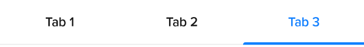
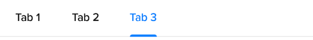
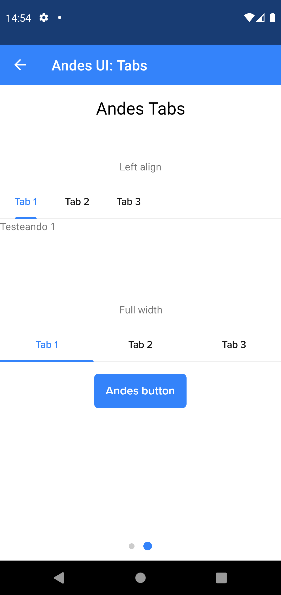

# AndesTabs

AndesTabs allows you to organize content by grouping information in different sections. Sections are displayed at once headed by precise and concise labels.
[See Andes UI component in frontify](https://company-161429.frontify.com/d/kxHCRixezmfK/n-a#/components/tabs)

```kotlin
class AndesTabs : ConstraintLayout
```

Basic Sample Programatically

```kotlin
AndesTabs(context)
```

Basic Sample XML

```xml
    <com.mercadolibre.android.andesui.tabs.AndesTabs
        android:layout_width="match_parent"
        android:layout_height="wrap_content"
        app:andesTabsType="full_width" />
```

<br/>

## XML Attributes
| Property | Summary |
| -------- | ------- |
| app:andesTabsType | Determines tab items style: **full_width**, **left_align**. Default value is **full_width** |

<br/>

## Constructors
| Summary |
| ------- |
| AndesTabs(context: Context, attrs: AttributeSet?) |
| [AndesTabs](#andestabscontext-context-tabs-listltandestabitemgt-type-andestabstype)(context: Context, tabs: List<[AndesTabItem](#andestabitem)\>, type: [AndesTabsType](#andestabstype)) |

<br/>

##### AndesTabs(context: Context, tabs: List<AndesTabItem\>, type: AndesTabsType)
| Parameter | Description |
| -------- | ------- |
| context | **Context**|
| tabs | **List<[AndesTabItem](#andestabitem)\>**: list of sections to show inside the container. |
| type | **[AndesTabsType](#andestabstype)**: set tab type style. Default value is **FullWidth** |

<br/>

## Properties
| Property | Summary |
| -------- | ------- |
| type: [AndesTabsType](#andestabstype) | **get():** retrieves tabs type style. <br/> **set(value: AndesTabsType):** updates tabs type style. |
| selectedTabPosition: Int | **get():** retrives current tab position. |

<br/>

#### Functions
| Return type | Method |
| -------- | ------- |
| Unit | **setItems(tabs: List<[AndesTabItem](#andestabitem)>)**<br/> Changes the list of sections in [AndesTabs](#andestabs). |
| Unit | **selectTab(atPosition: Int, animate: Boolean)**<br/> Select a tab at the given position. The selection can be animated or not depending on the animate parameter value. Animate default value is *true*. |
| Unit | **setupWithViewPager(viewPager: ViewPager)**<br/> Links the viewPager with the [AndesTabs](#andestabs) in order to coordinate both components behaviors. |
| Unit | **setOnTabChangedListener(listener: [OnTabChangedListener](#ontabchangedlistener)?)**<br/> Sets a callback to AndesTabItem select actions. |

<br/>

## Related Classes

### AndesTabsType
Defines the possible type styles that AndesTabs can take.
```kotlin
sealed class AndesTabsType
```
| Values | Description |
| ----------- | ----------- |
| FullWidth | Will fill the available width in screen with all [AndesTabItems](#andestabitem). It is not recommended to use this type when the number of items is large.<br/> |
| LeftAlign | **LeftAlign(overflowMode: Boolean):** will add [AndesTabItems](#andestabitem) to the screen starting from the left. In case the number of items is bigger than the available space, the container will scroll in order to show all items. overflowMode will show a shadow at the end of the screen, the default value is false.<br/> |

<br/>

#### Functions
| Return type | Method |
| -------- | ------- |
| AndesTabsHierarchy | **fromString(value: String)**<br/> Retrieves an AndesTabsType that matches the string value |

<br/>

### AndesTabItem
Represents a section of [AndesTabs](#andestabs) view.

```kotlin
data class AndesTabItem
```

#### Constructors
| Summary |
| ------- |
| [AndesTabItem](#andestabitemtitle-string-isenabled-boolean)(title: String, isEnabled: Boolean) |

###### AndesTabItem(title: String, isEnabled: Boolean)
| Parameter | Description |
| -------- | ------- |
| title | **String**: text of the section displayed. |
| isEnabled | **Boolean**: sets if the section is selectable or not. |

<br/>

### OnTabChangedListener
Callback interface for responding to changing state of the selected tab.
```kotlin
interface OnTabChangedListener
```

#### Functions
| Return type | Method |
| -------- | ------- |
| Unit | **onTabSelected(position: Int, tabs: List<[AndesTabItem](#andestabitem)>):** This method will be invoked when a new tab becomes selected. |
| Unit | **onTabUnselected(position: Int, tabs: List<[AndesTabItem](#andestabitem)>):** This method will be invoked when a the current tab becomes unselected. |
| Unit | **onTabReselected(position: Int, tabs: List<[AndesTabItem](#andestabitem)>):** This method will be invoked when a the current tab is selected again. |

<br/>

## Screenshots
